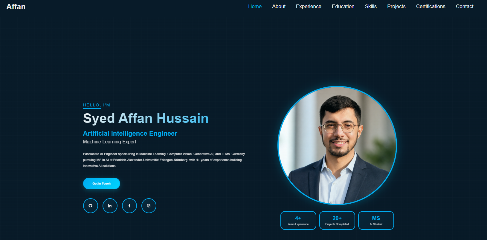

  <h1>🚀 Syed Affan Hussain - AI Engineer Portfolio</h1>
  
<strong>A Modern, Interactive Portfolio Showcasing AI Engineering Expertise & Full-Stack Development</strong>

  
  
  
  
  
  ### 📸 Portfolio Preview
  
  
  **[🌐 View Live Portfolio →](https://syedaffan.dev/)**

---

## 🤝 Connect

- **Portfolio**: [syedaffan.dev](https://syedaffan.dev/)
- **GitHub**: [@SyedAffan10](https://github.com/SyedAffan10)
- **LinkedIn**: [Syed Affan Hussain](https://www.linkedin.com/in/syedaffan10)
- **Email**: syedaffan.dev@gmail.com

---

  
<strong>Made with ❤️ by Syed Affan Hussain</strong>

